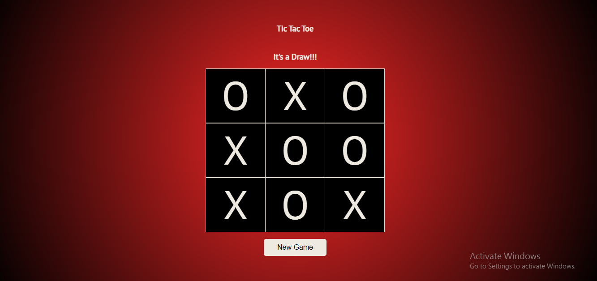

# Tic-Tac-Toe Game

## Table of Contents

 - [Introduction](#introduction)
 - [Screenshot](#Screenshot)
 - [Technology Stack](#Technology-Stack)
 - [Available Scripts](#Available-Scripts)

 - ### Introduction

**Tic-tac-toe** is a game in which two players take turns in drawing either an **'O'** or an **'X'** in one square of a grid consisting of nine squares. The winner is the first player to get three of the same symbols in a row.

- ### Screenshot(UI template)

- ### Technology Stack

To get started with this project you need a basic knowledge of :
[Javascript(ES6)](https://es6.io/)

- #### __Library__
[ReactJs](https://reactjs.org/)

- #### __Bundled with__
[Webpack.js](https://webpack.js.org)

- #### __Style guide__
[Airbnb ](https://github.com/airbnb/javascript)(Javascript style guide)

- ### Available Scripts

Clone the repo,
Then open terminal/bash/cmd you desired. cd to project directory, you can run : 

Install package dependencies

### `npm install`

Start the App

### `npm run start`
Starts the app in the development mode

Enjoy the game and drop feedback at `ezikeonyinyefavour@gmail.com`
